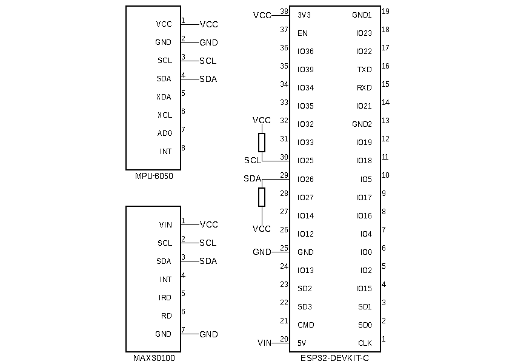

# Move Your Body

Code provided in this repository gets the raw data from MPU-6050 and MAX30100, calculates a step counter and heart rate, and stores it in the ESP-32 SPIFFS to be send via bluetooth to the MYB App.

## Table of Contents

- [Components](#components)
  - [ESP 32](#esp-32)
  - [ESP-IDF](#esp-idf)
  - [MPU-6050](#mpu-6050)
  - [MAX30100](#max30100)
- [Quick Start](#quick-start)
  - [Connect](#connect)
  - [Configuration and Flash](#configuration-and-flash)
- [How It Works](#how-it-works)
- [Next Steps](#next-steps)
  - [Software](#software)
- [Authors](#authors)
- [License](#license)
- [Acknowledgments](#acknowledgments)

## Components

To make this code work, you need the following components:

* This repository. It contains submodules, so make sure you clone it with `--recursive` option. If you have already cloned it without `--recursive`, run `git submodule update --init`.
* [ESP 32](https://espressif.com/en/products/hardware/esp32/overview) module.
* [ESP-IDF](https://github.com/espressif/esp-idf).
* [MPU-6050](https://www.invensense.com/products/motion-tracking/6-axis/mpu-6050/) module.
* [MAX30100](https://www.maximintegrated.com/en/products/sensors/MAX30100.html) module.

### ESP 32

Any ESP 32 module should work.

### ESP-IDF

Configure your PC according to [ESP 32 Documentation](https://docs.espressif.com/projects/esp-idf/en/latest/?badge=latest?badge=latest). Windows, Linux and Mac OS are supported.

### MPU-6050

This example has been tested with a MPU-6050. 

The MPU-6000 should work aswell.

### MAX30100

Any MAX30100 module should work.

## Quick Start

If you have your components ready, follow this section to [connect](#connect) the components to the ESP 32 module, [flash](#configuration-and-flash) the application to the ESP 32 and monitor the data.

### Connect

The pins used in this project to connect the ESP 32 to the MPU-6050 and MAX30100 are shown in the table below. The pinout can be adjusted in the software.

| Interface | MPU-6050 Pin | MAX30100 Pin | ESP 32 DevKitC Pin Mapping |
| :--- | :---: | :---: | :---: |
| I2C Serial Clock | SCL | SCL | IO25 |
| I2C Serial Data | SDA | SDA | IO26 |
| Power Supply 3.3V | VCC | VIN | 3V3 |
| Ground | GND | GND | GND |

Notes:

If the sensors are not communicating with the ESP 32, consider adding 10kΩ pull-up resistors to the SCL and SDA lines.



If you're using ESP 32 on Windows and is having the [ESP 32 Reset to Bootloader](https://github.com/espressif/esptool/issues/136) issue, add a 2.2uF capacitor conencted between GND and EN pins of ESP 32 module.

### Configuration and Flash

1. Clone the code provided in this repository to your PC.

2. To use the SPIFFS, you need a tool to create the SPIFFS partition image - we recommend using [igrr](https://github.com/igrr)'s [mkspiffs](https://github.com/igrr/mkspiffs).
After creating the SPIFFS image, use the `esptool` to flash the image binary to the module.
If you're gonna use the `partitions.csv` file, use the following configuration:
```
BLOCK SIZE = 4096
PAGE SIZE = 256
PARTITION SIZE = 0x2F0000
PARTITION OFFSET = 0x110000
```

3. On the `menuconfig`, use the following options:
```
Flash size: 4MB
Partition Table: Custom Partition Table CSV (choose the partitions.csv file)
```

4. Compile with the latest ESP-IDF installed from GitHub and download it to the module.

## How it Works

### Software

The software has 3 libraries, all located in the components folder:
* [esp32_i2c_rw.c](https://github.com/gabrielbvicari/esp32-i2c_rw/blob/f532d6a554dc2f2daa3954b597072ecb48354688/esp32_i2c_rw.c) and [include/esp32_i2c_rw.h](https://github.com/gabrielbvicari/esp32-i2c_rw/blob/f532d6a554dc2f2daa3954b597072ecb48354688/include/esp32_i2c_rw/esp32_i2c_rw.h) - implementation of the I2C protocol used by the [MPU-6050](https://github.com/gabrielbvicari/esp32-mpu6050) library.

* [mpu6050.c](https://github.com/gabrielbvicari/esp32-mpu6050/blob/fa99df4a75917e85b31b20e94344acca3d00d556/mpu6050.c), [include/mpu6050.h](https://github.com/gabrielbvicari/esp32-mpu6050/blob/fa99df4a75917e85b31b20e94344acca3d00d556/include/mpu6050/mpu6050.h) and [include/mpu6050_registers.h](https://github.com/gabrielbvicari/esp32-mpu6050/blob/fa99df4a75917e85b31b20e94344acca3d00d556/include/mpu6050/mpu6050_registers.h) - definition of the registers of the MPU-6050, setters/getters functions for the registers aswell as functions of calibration and self-test.

* [max30100.c](https://github.com/aedalzotto/esp32-max30100/blob/2585aa70b25955ecb60d2d8fb26c5cbb76526d65/max30100.c), [include/max30100.h](https://github.com/aedalzotto/esp32-max30100/blob/2585aa70b25955ecb60d2d8fb26c5cbb76526d65/include/max30100/max30100.h) and [include/registers.h](https://github.com/aedalzotto/esp32-max30100/blob/2585aa70b25955ecb60d2d8fb26c5cbb76526d65/include/max30100/registers.h) - definition of the registers of the MAX3010, setters/getters functions for the registers aswell as implementations of filters (Butterworth, DC Removal and Moving Average).

* component.mk - files used by C `make` command to access component during compilation.

Application is executed from [main.c](main/main.c) file located in main folder.
The main file has a step counter function, as well as log functions and routines that store the readings in the SPIFFS.

## Next Steps

Add the GATT Bluetooth functionality to send the data stored in the SPIFFS to the MYB app.

## License

This project is licensed under the MIT License - see the LICENSE.md file for details.

## Acknowledgments

This application is using code based on:

* MPU-6050 implementation for Arduino by [Jeff Rowberg](https://www.i2cdevlib.com).
* MAX30100 implementation for Arduino by [Raivis Strogonovs](https://morf.lv/).